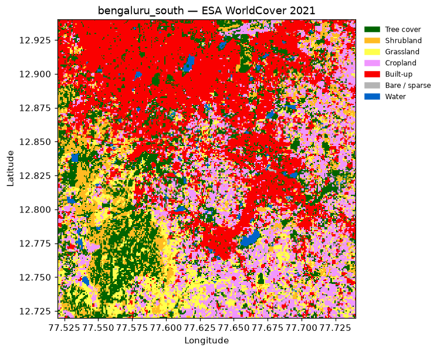
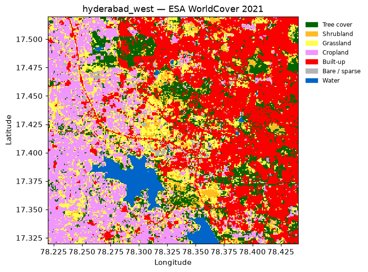
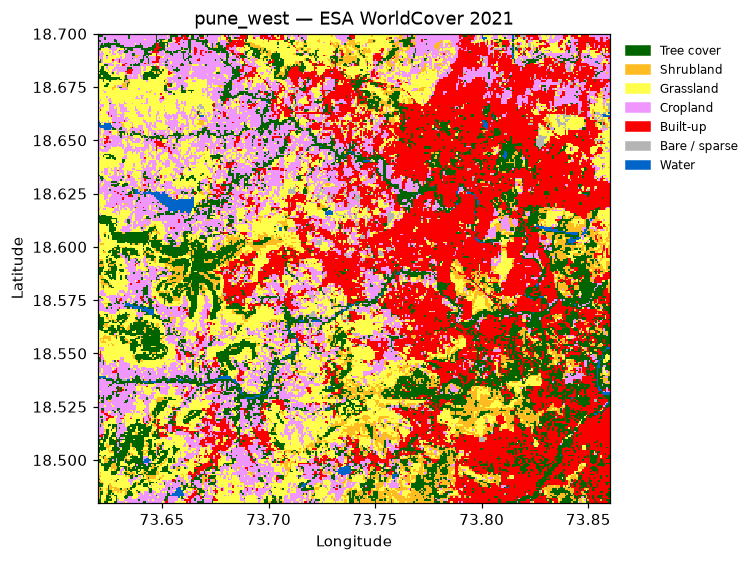

# Study area candidates (Task P0.9)

Candidate study areas checked against the selection criteria in [PRD §5.1](PRD.md#51-selection-criteria), for the team decision in **P0.10**.

> **Decision (P0.10, 2026-10-01): Bengaluru South**. Proposed by Abhinav, confirmed by Harsh. The reasons:
> - strong persistent growth (8.4 % of non-built land)
> - a clear forest block (Bannerghatta)
> - mostly gentle terrain
> - good OSM building coverage *in 2018*, which temporal validation needs
>
> Backups: Hyderabad West, then Pune West. The AOI is in `config/aoi.geojson` (582 km², EPSG:32643).

All numbers come from [`scripts/study_area_candidates.py`](../scripts/study_area_candidates.py) (raw output: [`img/study_area_candidates.json`](img/study_area_candidates.json)). Run on 2026-09-28. To rerun: `python scripts/study_area_candidates.py [name ...]`.

## How candidates were compared

- **Class mix:** ESA WorldCover 2021 shares. "Usable" = shrub + grass + crop + bare.
- **Growth:** the ESRI Annual LULC built-up class, **persistent** growth only: non-built in 2018 **and** 2019, built in 2022 **and** 2023.
  - The raw 2017 → 2023 difference is inflated by classifier flicker. Only 35–49 % of raw "new built" pixels are persistent.
  - The 2017 map is noticeably noisier than later years, so 2018 is the baseline.
  - "Growth % of non-built" = persistent new built-up ÷ land that was non-built in 2018.
- **OSM coverage (ohsome history API):**
  - Building footprints on **2018-01-01** and **2026-01-01**. The 2018 count matters, because temporal validation needs the buildings that existed at the baseline.
  - Major-road length (motorway to secondary), today.
- **Precision:** rasters were read at ~80 m, so the numbers are for comparing candidates only.

## Results (14 candidates, sorted by growth)

| Candidate | Area km² | Built % | Tree % | Usable % | Water % | Growth % of non-built | OSM bldgs 2018 | OSM bldgs 2026 | Major roads km |
|---|---|---|---|---|---|---|---|---|---|
| Ranchi | 498 | 19.1 | 15.5 | 64.4 | 1.0 | **10.1** | 558 ❌ | 1,838 ❌ | 380 |
| **Hyderabad West** | 518 | 34.8 | 14.3 | 46.7 | 4.1 | **9.9** | **191,309** | 216,856 | 714 |
| **Bengaluru South** | 582 | 34.4 | 19.2 | 44.9 | 1.6 | **8.4** | **151,374** | 186,526 | 606 |
| Gurugram | 430 | 40.4 | 13.5 | 45.5 | 0.6 | 8.0 | 123,037 | 122,537 | 542 |
| **Pune West** | 617 | 28.5 | 18.3 | 52.4 | 0.8 | 7.1 | 117,552 | 132,636 | 828 |
| Coimbatore | 532 | 36.4 | 23.8 | 38.9 | 0.9 | 6.9 | 736 ❌ | 162,092 | 434 |
| Chennai SW | 581 | 33.1 | 29.3 | 31.4 | 6.2 | 5.8 | 137,687 | 147,198 | 554 |
| Bhubaneswar | 559 | 15.6 | 35.4 | 47.1 | 2.0 | 5.1 | 503 ❌ | 21,817 | 326 |
| Bhopal | 499 | 23.2 | 13.1 | 57.9 | 5.9 | 3.9 | 158,481 | 159,732 | 421 |
| Kharagpur | 502 | 5.9 | 32.6 | 60.2 | 1.3 | 3.4 | 238 ❌ | 454 ❌ | 211 |
| Guwahati | 478 | 20.9 | 56.2 | 11.1 | 11.8 | 2.9 | 237 ❌ | 2,661 ❌ | 290 |
| Navi Mumbai | 513 | 16.4 | 29.9 | 46.6 | 7.2 | 2.9 | 56,243 | 57,046 | 556 |
| Visakhapatnam | 517 | 17.4 | 54.1 | 24.7 | 3.7 | 2.7 | 2,471 ❌ | 12,333 | 448 |
| Dehradun | 470 | 18.9 | 64.0 | 17.2 | 0.0 | 2.5 | 4,387 ❌ | 10,982 | 186 |

Water % = water + wetland + mangroves. ❌ = too few buildings mapped for a reference set.

**Key observation: OSM history matters.** Several cities were mapped in bulk only *after* 2018:
- Coimbatore: 736 → 162k buildings
- Bhubaneswar: 503 → 22k buildings

They look fine today, but they can't supply a 2018 building reference set, so the similarity method can't be validated there.

## Shortlist

### 1. Bengaluru South (recommended)

Bbox 77.52–77.74 E, 12.72–12.94 N. Covers Electronic City, Bommasandra and the Hosur Road corridor, the Kanakapura Road fringe, and **Bannerghatta National Park** in the south-west.

- **For:**
  - Strong growth (8.4 % of non-built land).
  - The clearest compact forest block of the shortlist (Bannerghatta, 19 % tree cover), next to open cropland and scrub.
  - Mostly gentle terrain.
  - **Good OSM coverage in 2018** (151k buildings), so temporal validation with a 2018 reference set works.
- **Against:**
  - Bannerghatta NP and its eco-sensitive zone must go in the exclusion mask. Otherwise it could score as "usable" scrub next to the city.
  - Many small tanks (lakes) need a water mask.

### 2. Hyderabad West

Bbox 78.22–78.44 E, 17.32–17.52 N. Covers Gachibowli, the Financial District and Kokapet, the Outer Ring Road, and the **Osman Sagar / Himayat Sagar** reservoirs.

- **For:**
  - The fastest growth among areas with usable OSM (9.9 %).
  - The best OSM coverage (191k buildings in 2018).
  - Large farmland to the west for growth to move into.
- **Against:**
  - Tree cover is scattered, not a clear forest block, so the forest class may be weak.
  - The reservoir catchments have legal building restrictions (the "111 G.O." zone). That's an interesting planning constraint, but it means observed growth partly reflects regulation.

### 3. Pune West (previous recommendation)

- **For:** the most usable land (52 %), good 2018 OSM, and a well-studied area.
- **Against:** growth (7.1 %) is below the top two, and forest is in scattered hill patches.

### Others considered

| Area | Why not |
|---|---|
| Gurugram | Aravalli shows up as *shrubland*, not forest (13.5 % tree) |
| Chennai SW | Less usable land and growth; more water |
| Ranchi | Highest growth, but OSM almost empty |
| Coimbatore, Bhubaneswar | No 2018 OSM buildings |
| Bhopal, Navi Mumbai | Low growth |
| Kharagpur, Guwahati, Visakhapatnam, Dehradun | Low growth and poor OSM |

WorldCover maps of all 14 candidates are in [`img/`](img/).

## Recommendation

**Bengaluru South first, Hyderabad West second.**

- Both have strong persistent growth and good OSM coverage *in 2018*. That's what the building-similarity method and its temporal validation need.
- Bengaluru South also has a distinct forest block, which gives the three-class clustering a clear forest class.
- Pune West remains a solid fallback.

## Next steps (P0.10, both)

1. Agree on the area.
2. Draw the final AOI polygon in `config/aoi.geojson`. The boxes above are a starting point; stay within 200–1,000 km².
3. Set `aoi.name` (and optionally `aoi.city_center`) in `config/config.yaml`.
4. Run `pytest tests/gates/test_phase0.py`, which should then be fully green.

## Caveats

- Shares and growth are read from COG overviews at ~80 m with nearest-neighbour resampling. They're good for ranking, not for analysis.
- ESRI's "built area" class is broader than WorldCover's "built-up", so compare growth *between candidates*, not with WorldCover levels.
- OSM counts are polygons tagged `building=*` at each date. Buildings mapped later may still have existed in 2018.
- The boxes are rectangles; a final AOI clipped to a planning boundary will shift the numbers.
